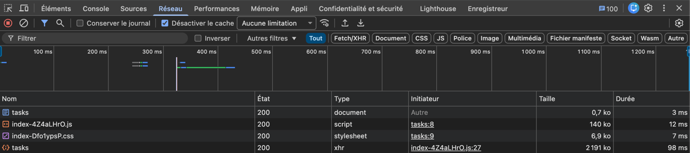

# Audit Technique - Projet TaskWatch

## 1. Analyse de l'architecture

Pour commencer cet exercice, j'ai regardé comment l'application **TaskWatch** était construite. C'est une architecture classique en trois parties :

- un front en Vue 3
- un back en Node.js (TypeScript)
- une base de données PostgreSQL

Les points les plus sensibles étaient la liste des tâches (`/tasks`), le tableau de bord et le système de chronomètre. Même si le code est bien découpé en couches (Routes, Contrôleurs, Repositories), j'ai remarqué que la logique métier et l'accès à la base de données sont parfois un peu trop mélangés, ce qui rend le code plus difficile à faire évoluer.

## 2. Ma méthode de travail et mes outils

Pour ne pas rester sur une simple impression que « c'est lent », j'ai utilisé les outils vus en cours :

- Côté navigateur :
  - onglet Réseau pour mesurer la taille des réponses
  - onglet Performance pour comprendre pourquoi l'interface se figeait
- Côté serveur :
  - `EXPLAIN ANALYZE` pour analyser les plans d'exécution SQL
  - tests de charge avec Autocannon

Grâce à ces outils, j'ai établi que le serveur envoyait 2,19 Mo de données d'un coup, ce qui exigeait beaucoup de travail CPU pour sérialiser tout ça en JSON (impact sur le TTFB et la latence perçue).

> Exemples de commandes utilisées

```bash
# Analyse d'une requête SQL
psql -c "EXPLAIN ANALYZE SELECT * FROM tasks WHERE user_id = 1;"

# Test de charge rapide
npx autocannon -c 50 -d 20 http://localhost:3000/api/tasks
```




## 3. Les problèmes que j'ai identifiés

### 3.1 Au niveau de la base de données

- Les index sur les colonnes `status` et `user_id` étaient désactivés (commentés) dans le script de création de la base, ce qui provoquait des Sequential Scans.
- Il n'y avait pas de pagination : l'application réalisait un `SELECT *` et récupérait toutes les tâches d'un coup.

Conséquences : lecture complète des tables à chaque requête, transfert de gros volumes, surcharge CPU lors de la sérialisation.

### 3.2 Au niveau de la qualité du code

- Dans le front, j'ai trouvé une fonction `heavyComputation` qui effectuait une boucle de plusieurs millions d'itérations sans utilité réelle, bloquant le thread principal.
- Le manque de séparation claire entre logique métier et accès aux données complique la maintenance et l'évolution.

## 4. Ce que j'ai corrigé (et ce qu'il reste à faire)

J'ai dû prioriser les actions pour obtenir des gains rapides.

Ce que j'ai fait immédiatement :

- Rallumé les index SQL sur `status` et `user_id`.
- Ajouté une pagination (`LIMIT` / `OFFSET`) dans le repository des tâches, pour éviter d'envoyer tout le jeu de résultats.
- Supprimé la boucle inutile `heavyComputation` côté front pour libérer le thread principal.

Ce que je n'ai pas eu le temps de finirpar manque de temps (travail futur recommandé) :

- Regrouper les appels du dashboard (actuellement 4 appels) en une seule requête SQL plus efficace.
- Refactoriser les accès API côté front pour centraliser les appels et réutiliser le cache local.

## 6. Pour la suite (Monitoring)

Pour éviter les régressions, je recommande d'industrialiser le suivi :

- Installer Sentry pour centraliser les erreurs utilisateur et les prioriser automatiquement.
- Mettre en place un dashboard Grafana connecté aux métriques (temps de réponse par endpoint, taux d'erreurs 5xx, CPU/RAM de la base) pour surveiller l'impact des déploiements en continu.
